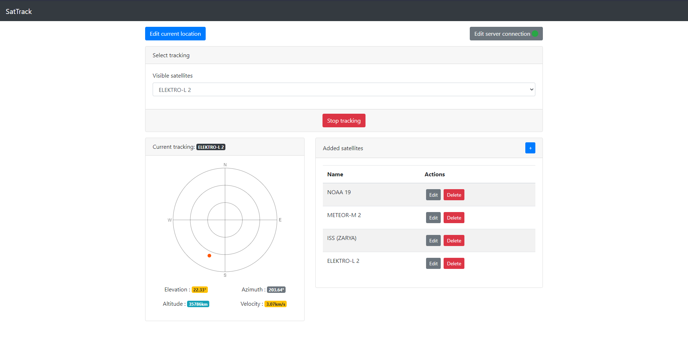

# SatTrack

## The modern all-in-one satellite tracking solution

### What is SatTrack ?
TODO

### What's working
TODO

### TODOs
 * [ ] Loading feedback when the user make an update (sattellite TLE update, etc..), actually it rely on the websocket response every second to update
 * [ ] Plotting the satellite passage on the polar view
 * [ ] Tests
 * [ ] Forbid actions (like accessing location form) when the Websocket is not connected
